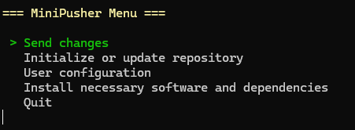

# Minipusher

> Minipusher is a minimalist software that allows you to make simple interactions with a repository.




## Features

* [1. Send changes](#1.-send-changes)
* [2. Initialize or update repository](#2.-initialize-or-update-repository)
    * [2.1 The folder already exists and is a repository](#2.1-the-folder-already-exists-and-is-a-repository)
    * [2.2 The folder doesn't exists](#2.2-the-folder-doesnt-exists)
        * [2.2.1 Success](#2.2.1-success)
        * [2.2.2 Fail](#2.2.2-fail)

## 1. Send changes

```

=== Send changes ===
Name for the new branch (has to be unique, no other branch can exist with that name): MyBranch
What have you changed ?: <commit message>

```

## 2. Initialize or update repository

```

=== Initialize or update repository ===
Local folder: Minipusher

```
> ### 2.1 The folder already exists and is a repository
> > It will `pull` the remote repository
> ```
> === Initialize or update repository ===
> Local folder: Minipusher
>   Repository already exists. Updating ...
>   D       minipusher.bat
>   D       minipusher.ps1
>   Already on 'main'
>   Your branch is up to date with 'origin/main'.
>   From https://github.com/thomas-delplace/Minipusher
>    * branch            main       -> FETCH_HEAD
>   Already up to date.
>   Repository updated !
>   Important : Update repo as soon as the changes have been accepted by the system admin !
>   Press any key to continue ...
> ```

> ### 2.2 The folder doesn't exists
>
> > #### 2.2.1 Success
> > ```
> > === Initialize or update repository ===
> > Local folder: MinipusherRepo
> > Enter the url of the repository to clone: https://github.com/thomas-delplace/Minipusher.git
> >   Cloning into 'A:\scripts\MinipusherRepo'...
> >   remote: Enumerating objects: 7, done.
> >   remote: Counting objects: 100% (7/7), done.
> >   remote: Compressing objects: 100% (6/6), done.
> >   remote: Total 7 (delta 0), reused 4 (delta 0), pack-reused 0 (from 0)
> >   Receiving objects: 100% (7/7), 14.80 KiB | 7.40 MiB/s, done.
> >   Success : repository cloned into A:\scripts\MinipusherRepo !
> >   Press any key to continue ...
> > ```
> 
> > #### 2.2.2 Fail
> > ```
> > === Initialize or update repository ===
> > Local folder: test3
> > Enter the url of the repository to clone: https://github.com/thomas-delplace/nonExistentRepository.git
> > Cloning into 'A:\scripts\test3'...
> > remote: Repository not found.
> > fatal: repository 'https://github.com/thomas-delplace/nonExistentRepository.git/' not found
> > **Error : cloning canceled !**
> > Press any key to continue ...
> > ```
